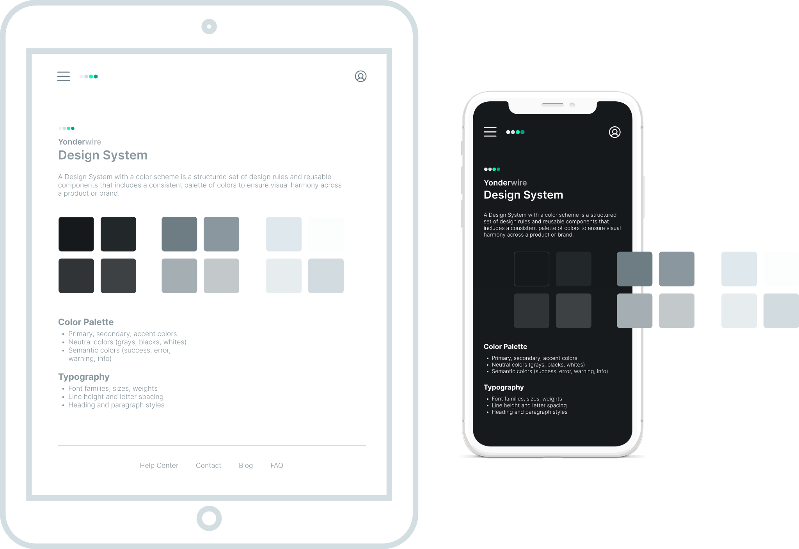

<div align="center">
    <p>
        <br>
        <small>Yonderwire</small> <br>
        <strong>Design System</strong> <br>
    </p>
    <small>
        <a href="#getting-started" width="500">Getting Started</a> 
        &nbsp;&nbsp;•&nbsp;&nbsp; 
        <a href="#project-structure">Project Structure</a>
        <br><br>
    </small>

</div>
<div align="center">
    
</div>


### Getting Started
<small>
    The Yonderwire Design System is a scalable, themeable UI framework that provides a consistent foundation for building user interfaces. It includes standardized color tokens, typography, spacing, and iconography to ensure visual and functional cohesion across all platforms. Designed with accessibility and modularity in mind, it supports multiple themes (light, dark, dim) and is built for rapid development using modern tooling like Vite and vanilla JavaScript.
</small>

1. Install node.js runtime engine
    ```bash
    node --version
    ```
2. Install vite build tool
    ```bash
    npm create vite@latest cs-app
    ```
3. Run app
    ```bash
    cd <project_name>
    npm install
    npm run dev
    ```


### Project Structure
<small>Built with Vite and vanilla JavaScript for quick prototyping and fast builds. Serves as the foundation for UI component design and token management.</small>
1. `ds-app/` – Core Design System
2. `ds-color-scheme-app/` – includes color schemes and theme tokens for light, dark, and dim modes.
3. `ds-icons-app/` –  includes available icons and artifacts