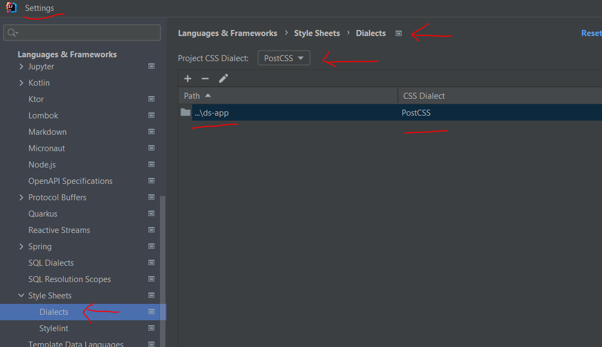

# ds-app


### Getting Started
1. Install Vite to run with plain JavaScript
    ```bash
    npm create vite@latest cs-app -- --template react
    cd ds-app
    npm install # downloads packages in the package.json file
    npm run dev
    ```

2. Configure CSS for PostCss
   

 
### Tools
| Type           | Tool     | Version   | Description                  |
|----------------|----------|-----------|------------------------------|
| Build Tool     | Vite     | 6.3.5     | Fast frontend build tool     |
| Runtime Engine | Node.js  | 22.15.0   | JavaScript runtime engine    |